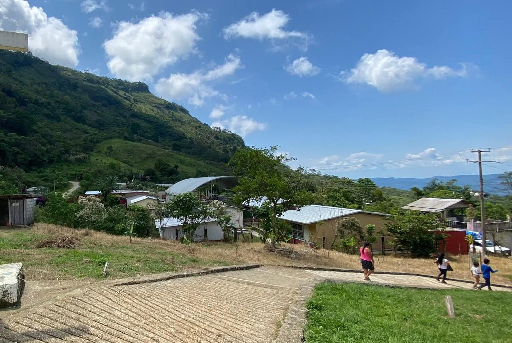
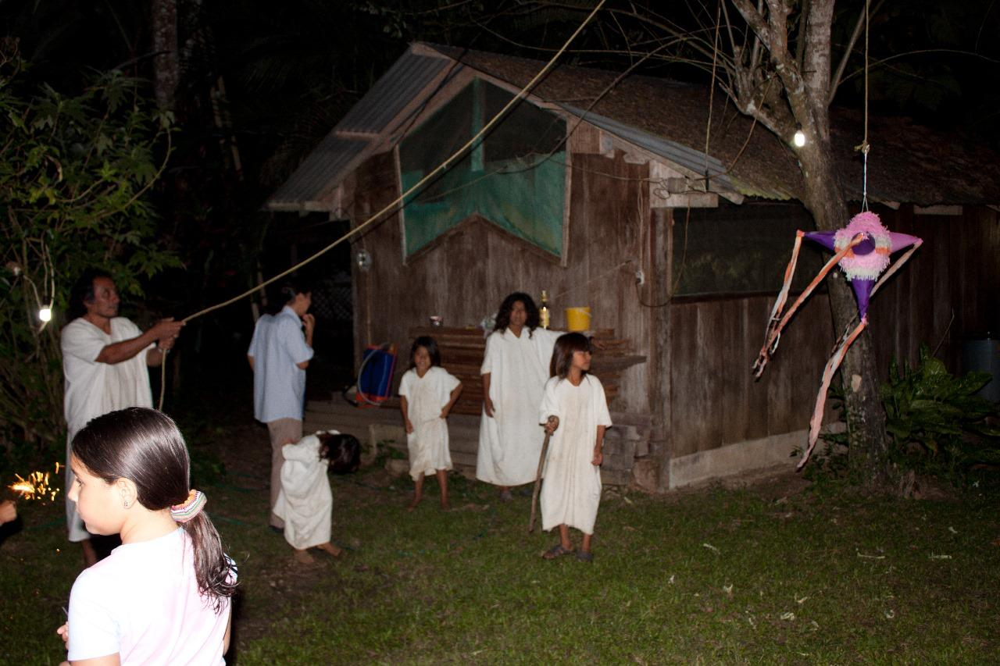
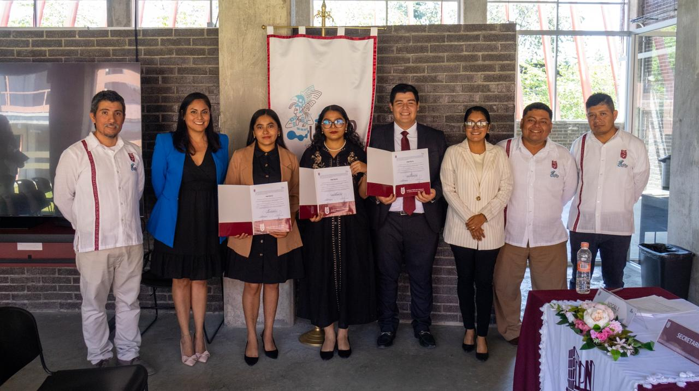

```{python}
#| include: false

import pandas as pd
import plotly.graph_objects as go
import plotly.express as px
import warnings
warnings.filterwarnings("ignore")

from IPython.core.interactiveshell import InteractiveShell
InteractiveShell.ast_node_interactivity = "last_expr"
import plotly.io as pio
pio.renderers.default = "notebook"

# ══════════════════════════════════════════════════════════════════════
# SISTEMA DE COLOR — mismo significado en todo el tablero
# C_RED   (#f87171) → Suroeste crítico (Chiapas · Guerrero · Oaxaca)
# C_AMBER (#fbbf24) → En desarrollo   (internet 65–78 %)
# C_GREEN (#4ade80) → Mayor conectividad / Norte / Nodo solar
# C_BLUE  (#60a5fa) → Referencia nacional
# C_NAVY  (#1e3a5f) → Estructura (encabezados, anillos de énfasis)
# C_MUTED (#94a3b8) → Elementos secundarios / otros estados
# ──────────────────────────────────────────────────────────────────────
# COLORES DE MÉTRICAS — solo en el gráfico de perfiles (Sección III)
# M_INTERNET  (#7dd3fc) → conectividad
# M_POBREZA   (#fb923c) → pobreza
# M_TITULADOS (#c084fc) → calidad educativa
# ══════════════════════════════════════════════════════════════════════
C_RED   = "#f87171"
C_AMBER = "#fbbf24"
C_GREEN = "#4ade80"
C_BLUE  = "#60a5fa"
C_NAVY  = "#1e3a5f"
C_MUTED = "#94a3b8"

M_INTERNET  = "#7dd3fc"
M_POBREZA   = "#fb923c"
M_TITULADOS = "#c084fc"

# ──────────────────────────────────────────────────────────────────────
# Marcas de formato que Plotly interpreta en tooltips y anotaciones.
# Se construyen con chr() en tiempo de ejecucion para mantener el
# fuente del tablero en markdown/Quarto puro (criterio md-only).
# ──────────────────────────────────────────────────────────────────────
_LT = chr(60)
_GT = chr(62)
_B  = _LT + "b"  + _GT
_Bc = _LT + "/b" + _GT
_BR = _LT + "br" + _GT
_EX = _LT + "extra" + _GT + _LT + "/extra" + _GT

FONT  = "Nunito, system-ui, sans-serif"
BG    = "rgba(0,0,0,0)"
FBASE = 13
FMED  = 12
FSML  = 11

def L(**ov):
    base = dict(
        paper_bgcolor=BG, plot_bgcolor="#f8fafc",
        font=dict(family=FONT, size=FBASE, color="#1a1a2e"),
        margin=dict(l=10, r=10, t=10, b=10),
    )
    base.update(ov)
    return base

COLOR_MAP = {
    "Suroeste crítico":   C_RED,
    "En desarrollo":      C_AMBER,
    "Mayor conectividad": C_GREEN,
}

DATA      = "../datos"
estados   = pd.read_csv(f"{DATA}/estados.csv")
tendencia = pd.read_csv(f"{DATA}/tendencia_abandono.csv")
nac       = pd.read_csv(f"{DATA}/nacional.csv").iloc[0]

MEDIA_NAC  = nac["media_nacional"]
PCT_URBANO = nac["pct_urbano"]
PCT_RURAL  = nac["pct_rural"]
BRECHA_UR  = nac["brecha_ur"]

estados["nodo"]   = estados["nodo"].astype(bool)
estados           = estados.sort_values("internet_pct").reset_index(drop=True)
estados["region"] = estados["internet_pct"].apply(
    lambda x: "Suroeste crítico" if x < 65 else ("En desarrollo" if x < 78 else "Mayor conectividad")
)

CHI_BRECHA  = round(100 - estados.loc[estados["CVE_ENT"]==7,  "internet_pct"].values[0], 1)
GRO_BRECHA  = round(100 - estados.loc[estados["CVE_ENT"]==12, "internet_pct"].values[0], 1)
OAX_BRECHA  = round(100 - estados.loc[estados["CVE_ENT"]==20, "internet_pct"].values[0], 1)

SUR_EXT_PCT = round(estados[estados["CVE_ENT"].isin([7,12,20])]["pob_extrema_pct"].mean(), 1)
NAC_EXT_PCT = round(estados["pob_extrema_pct"].mean(), 1)
SUR_EXT_ABS = int(estados[estados["CVE_ENT"].isin([7,12,20])]["pob_extrema_abs"].sum())

SUR_TIT = round(estados[estados["CVE_ENT"].isin([7,12,20])]["titulados_pct"].mean(), 1)
NAC_TIT = round(estados["titulados_pct"].mean(), 1)
NOR_TIT = round(estados[estados["CVE_ENT"].isin([2,5,19])]["titulados_pct"].mean(), 1)
```

## Banner s1 {.section-break .s1 height="110px"}

¿Cómo la **falta de infraestructura digital** en el suroeste de México limita el **derecho a una educación de calidad**?

## Row 

```{python}
#| content: valuebox
#| title: "Sin internet · Chiapas"
dict(icon="wifi-off", color="danger", value=f"{CHI_BRECHA:.1f} %")
```

```{python}
#| content: valuebox
#| title: "Sin internet · Guerrero"
dict(icon="wifi-off", color="danger", value=f"{GRO_BRECHA:.1f} %")
```

```{python}
#| content: valuebox
#| title: "Sin internet · Oaxaca"
dict(icon="wifi-off", color="danger", value=f"{OAX_BRECHA:.1f} %")
```

```{python}
#| content: valuebox
#| title: "Media nacional · ENDUTIH 2024"
dict(icon="wifi", color="info", value=f"{MEDIA_NAC:.1f} %")
```

## Row {height="745px"}

### Column {width="62%"}

```{python}
#| title: "Brecha digital por estado — República Mexicana"

metricas = [
    ("Sin internet",    "brecha",          "Reds",    False, "Hogares sin internet"),
    ("Pobreza extrema", "pob_extrema_pct", "Oranges", False, "Pobreza extrema"),
    ("Titulados MS",    "titulados_pct",   "Blues",   True,  "Egresados con título"),
]

fig_map = go.Figure()
for i, (label, col, cscale, rev, hover_lbl) in enumerate(metricas):
    vals  = estados[col].round(1).tolist()
    mn, mx = estados[col].min(), estados[col].max()
    sizes = [10 + 20*(v-mn)/(mx-mn) for v in vals]
    fig_map.add_trace(go.Scattergeo(
        lat=estados["lat"].tolist(), lon=estados["lon"].tolist(),
        mode="markers",
        marker=dict(
            size=sizes, color=vals,
            colorscale=cscale, reversescale=rev,
            cmin=mn, cmax=mx, showscale=True,
            colorbar=dict(
                title=dict(text=label, font=dict(size=FMED), side="right"),
                thickness=12, len=0.6, x=1.02, xanchor="left",
                y=0.5, yanchor="middle",
                tickfont=dict(size=FSML), outlinewidth=0,
                tickformat=".0f", ticksuffix="%",
            ),
            line=dict(color="#e2e8f0", width=0.5), opacity=0.88,
        ),
        text=estados["nombre"].tolist(), customdata=vals,
        hovertemplate=_B + "%{text}" + _Bc + _BR + hover_lbl + ": " + _B + "%{customdata:.1f}%" + _Bc + _EX,
        visible=(i==0), showlegend=False,
    ))

n = len(metricas)
COLORES_BTN = ["#fecaca", "#fed7aa", "#bfdbfe"]
buttons = []
for i, (label, *_) in enumerate(metricas):
    vis = [False]*n + [True]; vis[i] = True
    buttons.append(dict(
        label=label, method="update", args=[{"visible": vis}],
    ))

fig_map.update_layout(
    **L(margin=dict(l=2, r=2, t=2, b=2), height=250),
    updatemenus=[dict(
        type="buttons", buttons=buttons,
        direction="down", showactive=True, active=0,
        bgcolor="rgba(248,250,252,0.88)", bordercolor="#e2e8f0", borderwidth=1,
        font=dict(size=12, family=FONT),
        x=0.01, xanchor="left", y=1.0, yanchor="top",
        pad=dict(b=4, t=4, r=8, l=8),
    )],
    geo=dict(
    scope="world",                                    # ← cambiado (antes: "north america")
    showland=True, landcolor="#f1f5f9",
    showocean=True, oceancolor="#dbeafe",
    showcoastlines=True, coastlinecolor="#94a3b8", coastlinewidth=0.5,
    showcountries=True, countrycolor="#475569", countrywidth=0.7,
    showsubunits=True, subunitcolor="#94a3b8", subunitwidth=0.4,
    showlakes=False, showframe=False, bgcolor=BG,
    projection=dict(type="mercator"),
    lataxis=dict(range=[14, 33]),                    # ← NUEVO: rango vertical (sur → norte)
    lonaxis=dict(range=[-118, -86]),                 # ← NUEVO: rango horizontal (oeste → este)
    domain=dict(x=[0, 1], y=[0, 1]),
),
)
fig_map
```

### Column {width="38%"}

::: {.callout-important title="La Lotería Geográfica" icon=false}
En México, el lugar donde naces determina a qué oportunidades tienes acceso. Un estudiante en Monterrey tiene clases en video y bibliotecas digitales al instante. Uno en la sierra de Guerrero camina horas para llegar a la escuela y, al llegar, no hay señal.

No es un problema de esfuerzo. Es un problema de código postal.

- **Chiapas:** casi 5 de cada 10 hogares sin internet
- **Guerrero:** 4 de cada 10 sin internet
- **Oaxaca:** casi 5 de cada 10 sin internet
:::

{.img-cover-sm}

*Fuente: [Facebook — publicación de referencia](https://www.facebook.com/share/p/1GZVURVcwn/){.fuente-pie}*

::: {.callout-note title="¿Por qué importa?" icon=false}
Los estados con menor conectividad coinciden con los de mayor pobreza y marginación. El mapa puede verse en tres capas: brecha digital, pobreza extrema y calidad educativa. El patrón es el mismo en las tres.
:::

## Banner s2 {.section-break .s2 height="80px"}

**II** · La Raíz del Problema

## Row {height="850px"}

### Column {width="13%"}

```{python}
#| content: valuebox
#| title: "Pobreza extrema · Suroeste"
dict(icon="exclamation-diamond", color="danger", value=f"{SUR_EXT_PCT:.1f} %")
```

```{python}
#| content: valuebox
#| title: "Pobreza extrema · Nacional"
dict(icon="bar-chart", color="info", value=f"{NAC_EXT_PCT:.1f} %")
```

```{python}
#| content: valuebox
#| title: "Personas afectadas · Suroeste"
dict(icon="people", color="warning", value=f"{SUR_EXT_ABS/1e6:.1f} M")
```

### Column {width="87%"}

::: {.callout-important title="Cuando el internet es un lujo" icon=false}
Para una familia que vive con lo mínimo para comer, pagar internet no está en la conversación. Pero el problema va más allá del dinero. En muchas comunidades no existen las torres de señal ni la fibra óptica necesarias para conectarse.
:::

{.img-cover-lg}

*Imagen proporcionada por Jperez . Fuente: [Instagram — Jperez](https://www.instagram.com/p/DXfLOqzFhSp/?igsh=MThhc2d1M3NscWl2NQ==){.fuente-pie}*

::: {.callout-warning title="El ciclo que se perpetúa" icon=false}
En Chiapas, el **74.4 %** de la población vive en pobreza. Sin internet, sus hijos estudiarán en desventaja. Sin título, tendrán empleos de menor ingreso. Y la siguiente generación comenzará desde el mismo punto. Romper ese ciclo requiere actuar en ambos frentes: infraestructura digital **y** reducción de la pobreza.
:::

## Banner s3 {.section-break .s3 height="80px"}

**III** · El Costo en el Aula

## Row {height="680px"}

### Column {width="20%"}

```{python}
#| content: valuebox
#| title: "Titulados MS · Norte"
dict(icon="patch-check", color="success", value=f"{NOR_TIT:.1f} %")
```

::: {.callout-important title="El dato que no puede ignorarse" icon=false}
De cada 100 jóvenes que terminan el bachillerato en el suroeste, **menos de 6 obtienen su título oficial**. En el norte llegan a 17; nacional, 12 de cada 100.

Sin título, la puerta a la universidad se cierra antes de tocarla.
:::

### Column {width="60%"}

```{python}
#| title: "Conexión a internet y calidad educativa — ENDUTIH 2024 + SEP 2023-24"

df_sc = estados.dropna(subset=["titulados_pct","personas_sin_internet"]).copy()
df_dest_sc = df_sc[df_sc["CVE_ENT"].isin([7, 12, 20])]

fig_sc = px.scatter(
    df_sc,
    x="internet_pct", y="titulados_pct",
    color="region",
    color_discrete_map=COLOR_MAP,
    text="nombre",
    size="personas_sin_internet", size_max=26,
    labels={
        "internet_pct":  "Hogares con internet (%)",
        "titulados_pct": "Egresados con título (%)",
        "region": "",
    },
    custom_data=["nombre","titulados_pct","personas_sin_internet"],
)
fig_sc.update_traces(
    textposition="top center", textfont_size=FSML,
    marker=dict(opacity=0.82, line=dict(color="#e2e8f0", width=0.5)),
    hovertemplate=(
        _B + "%{customdata[0]}" + _Bc + _BR +
        "Con internet: %{x:.1f}%" + _BR +
        "Egresados con título: %{y:.1f}%" + _BR +
        "Personas sin internet: %{customdata[2]:,}" + _EX
    ),
)
fig_sc.add_trace(go.Scatter(
    x=df_dest_sc["internet_pct"], y=df_dest_sc["titulados_pct"],
    mode="markers",
    marker=dict(size=28, color="rgba(0,0,0,0)", line=dict(color=C_NAVY, width=2.2)),
    text=df_dest_sc["nombre"], showlegend=False,
    hovertemplate=_B + "%{text}" + _Bc + " — Estado prioritario" + _EX,
))
fig_sc.update_layout(
    **L(margin=dict(l=20, r=20, t=20, b=95), height=340),
    xaxis=dict(tickfont=dict(size=FSML), ticksuffix="%"),
    yaxis=dict(tickfont=dict(size=FSML), ticksuffix="%"),
    showlegend=True,
    legend=dict(
        orientation="h", yanchor="top", y=-0.28,
        xanchor="center", x=0.5,
        font=dict(size=11, family=FONT),
        bgcolor="rgba(248,250,252,0.95)",
        bordercolor="#e2e8f0", borderwidth=1, title_text="",
        itemsizing="constant",
        itemwidth=60,
        tracegroupgap=30,
        entrywidth=180,
        entrywidthmode="pixels",
    ),
)
fig_sc
```

### Column {width="20%"}

```{python}
#| content: valuebox
#| title: "Titulados MS · Suroeste"
dict(icon="x-circle", color="danger", value=f"{SUR_TIT:.1f} %")
```

::: {.callout-note title="Sobre los datos" icon=false}
**ENDUTIH 2024** (INEGI): 48,000+ hogares, representativa a nivel nacional.

**CONEVAL 2020**: pobreza municipal, Censo de Población.

**SEP 2023-24**: Media Superior únicamente. En comunidades rurales e indígenas la situación es más grave.
:::

{.img-cover-lg}

*Imagen proporcionada por Alexa (fotógrafa). Fuente: [Facebook — publicación de referencia](https://www.facebook.com/share/1EC85hUg4Q/){.fuente-pie}*

## Banner s4 {.section-break .s4 height="80px"}

**IV** · Construir Puentes

## Row {height="990px"}

### Column {width="28%"}

```{python}
#| content: valuebox
#| title: "Costo por nodo"
dict(icon="sun", color="warning", value="Accesible")
```

```{python}
#| content: valuebox
#| title: "Almacenamiento local"
dict(icon="hdd", color="info", value="500 GB")
```

```{python}
#| content: valuebox
#| title: "Comunidades potenciales"
dict(icon="house-heart", color="success", value="3,200 +")
```

```{python}
#| content: valuebox
#| title: "Fase 1 — estados"
dict(icon="geo-alt", color="danger", value="Chis · Oax · Gro")
```

### Column {width="44%"}

```{python}
#| title: "Contenido curado · 500 GB sin internet externo"

contenido = pd.DataFrame({
    "categoria": ["Libros SEP","Khan Academy","Wikipedia","Salud","Lenguas indigenas","Capacitacion"],
    "gb":        [150, 125, 100, 50, 40, 35],
})
fig_don = go.Figure(go.Pie(
    labels=contenido["categoria"], values=contenido["gb"], hole=0.48,
    marker=dict(
        colors=[C_GREEN,"#22c55e","#86efac","#fbbf24","#f97316",C_RED],
        line=dict(color="#f8fafc", width=2.5),
    ),
    textinfo="percent+label", textfont=dict(size=FSML),
    insidetextorientation="radial",
    hovertemplate=_B + "%{label}" + _Bc + _BR + "%{value} GB · %{percent}" + _EX,
    direction="clockwise", sort=False, showlegend=False,
))
fig_don.update_layout(
    **L(margin=dict(l=10, r=10, t=15, b=15), height=230),
    showlegend=False,
    annotations=[dict(
        text=_B + "500 GB" + _Bc + _BR + "sin internet", x=0.5, y=0.5,
        font=dict(size=12, color="#1a1a2e"),
        showarrow=False, xanchor="center", yanchor="middle",
    )],
)
fig_don
```

### Column {width="28%"}

::: {.callout-tip title="La respuesta técnica existe" icon=false}
La Constitución mexicana reconoce el acceso a las TIC como un derecho fundamental. Pero un derecho sin infraestructura es solo un documento.

La respuesta: el **Nodo Solar Comunitario**. Un servidor local con paneles solares, sin internet externo, sin costo mensual, sin depender de una señal que no llega.
:::

::: {.callout-note title="¿Cómo funciona?" icon=false}
El nodo almacena contenido curado: libros SEP, Khan Academy sin conexión, Wikipedia, recursos de salud e idiomas indígenas.

No tiene partes móviles — mantenimiento mínimo. La escuela o comisaría ejidal resguarda el equipo. Las universidades cercanas actualizan el contenido.

**Resultado:** educación autónoma y comunitaria desde cualquier dispositivo dentro del plantel.
:::

::: {.callout-warning title="Alianzas para los objetivos" icon=false}
Este modelo puede instalarse hoy, en las comunidades que más lo necesitan, sin esperar a que el gobierno resuelva la cobertura de señal.

La colaboración entre universidades, municipios y organizaciones civiles es el puente entre la tecnología disponible y quienes más la necesitan.

**Fuentes:** ENDUTIH 2024 · CONEVAL 2020 · SEP 2023-24
:::

## Row

::: {.callout-note title="Agradecimientos" icon=false}
Los autores agradecen al Instituto Politécnico Nacional por el apoyo en viáticos y hospedaje en la Residencia de Investigadores Visitantes, y al proyecto *"Sustentabilidad en el Sistema Ferroviario de Pasajeros de México: eficiencia de consumo de combustible debido a los sistemas de ventilación, confort térmico y calidad de aire"*, con registro **20254461** en la Secretaría de Investigación y Posgrado del Instituto Politécnico Nacional por el apoyo en inscripción y viáticos.
:::

